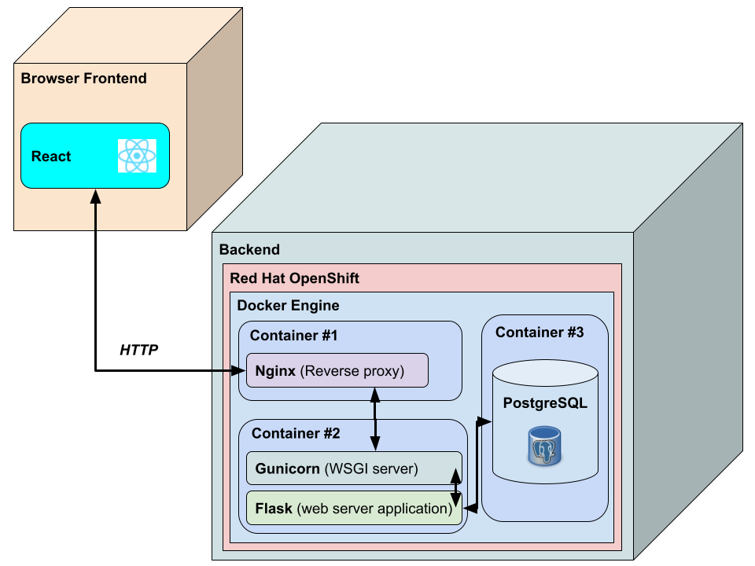

# IT-alan-soveltuvuustesti

## Update: 16.10.23
Archived the repository as it is not actively maintained. If you are going to use this for anything, at the very least update the dependencies.

## Introduction
Web-based aptitude self-test for high school students to see which ICT study program would be most fitting for them at University of Oulu. Developed as part of Research and Development Project course  (817612S) at the University of Oulu's Faculty of Information Technology and Electrical Engineering, department of Information Processing Science's master's programme.

The web application's frontend is written in a JS/HTML using React framework. The backend is written in Python3 using Flask framework.

The deployment of the implementation is demonstrated using Docker and Red Hat OpenShift targeting specifically CSC Rahti Cloud. Nginx web server is deployed as the reverse proxy for the WSGI server (Gunicorn) serving the server application, and PostgreSQL is the selected database solution.

## Repository organization

./api: Backend code.

./src and ./public: Frontend code.

./docker: Docker configuration files

./doc: Documentation and images.

## Deployment

Before we begin, you should note that the software is made up of several different components, including a Flask application, an NGINX web server, and a PostgreSQL database. Running the entire stack locally will require some setup and configuration. However, here are the high-level overview of the steps involved.

Here are the general steps you would need to follow to run the application locally on your machine using Docker Compose:

Clone the repository: Start by cloning the repository to your local machine. You can do this by running the following command in your terminal:
`git clone https://github.com/tonibom/IT-alan-soveltuvuustesti.git`

Install Docker and Docker Compose: The application is designed to run in Docker containers, so you will need to install Docker and Docker Compose if you haven't already. You can download Docker from the official website (https://www.docker.com/get-started) and Docker Compose is typically included in the Docker installation for Mac and Windows users. For Linux users, follow the instructions here: https://docs.docker.com/compose/install/

Set up the environment variables: You will need to create a .env file in the docker directory to store the environment variables that will be used by the Flask application to connect to the PostgreSQL database. You can create a copy of the example .env file by running the following command in your terminal:

`cp docker/.env.example docker/.env`

Then, open the .env file and update the `DB_NAME`, `POSTGRES_PASSWORD`, `ROLE_NAME`, `ROLE_PASSWORD`, `SQL_HOST`, and `DATABASE_URL` variables with your desired values. Make sure to use long passwords. The DB_NAME and ROLE_NAME can be chosen freely but the SQL_HOST should match the database service's name in docker/docker-compose-rahti.yml (e.g., 'soveltuvuustesti-db-rahti'). The DATABASE_URL should be of the format `postgresql://<ROLE_NAME>:<ROLE_PASSWORD>@<SQL_HOST>:<SQL_PORT>/<DB_NAME>` with the values of the corresponding fields without the <>.

Build and run the Docker images: In order to run the application, you will need to build the Docker images for the Flask application and the NGINX web server. You can do this by running the following command in your terminal from the project's docker directory:

`docker compose -f docker-compose-rahti.yml up --build`

This will build the images and start the PostgreSQL database, the Flask application, and the NGINX web server in separate Docker containers. You should see logs from each container in your terminal window.

Access the application: Once the containers are up and running, you should be able to access the applocation by visiting http://localhost:8080 in your web browser. If everything is set up correctly, you should see the IT-alan soveltuvuustesti homepage.

That's it! These are the general steps you would need to follow to run the application. However, please keep in mind that there may be additional setup required, such as configuring Rahti-specific options, depending on your specific use case.

Note: The configuration for the Rahti K8S deployment only works for the first prototype version.

